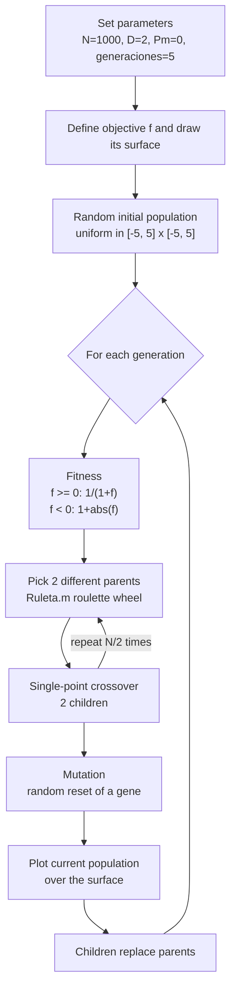

# Genetic Algorithm for Global Minimum Search (MATLAB)

A small MATLAB implementation of a real-coded **Genetic Algorithm (GA)** that searches for the global minimum of two-variable functions, using roulette-wheel selection, single-point crossover and random-reset mutation. Every generation is plotted as red markers over a 3D surface of the objective function, so the population can be watched as it converges.

<p align="center">
  
  
</p>
<p align="center"><em>f(x) = Σ(xᵢ − 2)², d = 2. Left: random initial population. Right: population after 5 generations.<br>Figures taken from the original 2019 report.</em></p>

---

## Project Context

| | |
|---|---|
| **Project type** | Academic / University Project (Coursework / Assignment) |
| **Institution** | Universidad de Guadalajara, CUCEI |
| **Course** | Sistemas Inteligentes II (Intelligent Systems II) |
| **Activity** | Práctica 3 (Lab Assignment 3) |
| **Author** | Omar Baruch Morón López |
| **Report date** | Monday, 18 February 2019 |
| **Uploaded to GitHub** | 20 February 2021 |
| **Original language** | Spanish (code comments and report) |

All of the above comes straight from the original report ([`docs/original/`](docs/original/)) and the Git history. See [`docs/project-context.md`](docs/project-context.md) for the evidence behind each item.

## Problem Statement

The assignment asked for *"a computer program that finds the global minimum of the following functions, using the Genetic Algorithms (GA) method"*:

| # | Function | Domain given in the assignment | Known global minimum |
|---|---|---|---|
| 1 | f(x, y) = x · e^(−x² − y²) | x, y ∈ [−2, 2] | ≈ −0.4289 at (−1/√2, 0) |
| 2 | f(**x**) = Σᵢ₌₁ᵈ (xᵢ − 2)², d = 2 | not specified | 0 at (2, 2) |

The report also asks: *"Is the GA method better than traditional methods? Why?"*

## Objective

Implement a GA from scratch (no toolbox GA solver is used), show visually that the population converges toward the minimum of each function, and reflect on the strengths and weaknesses of GAs compared with classical optimization methods.

## Repository Structure

```
.
├── README.md                  This file
├── AGENTS.md                  Rules for automated/AI contributors (source code is read-only)
├── LICENSE                    MIT License (2021, Baruch Lopez)
├── src/                       Original MATLAB source code (unchanged)
│   ├── AlgoritmoGeneticoParaMinimos_SeleccionNatural.m   Main script
│   └── Ruleta.m                                          Roulette-wheel selection function
├── docs/
│   ├── project-context.md     Where the project comes from and what is known about it
│   ├── assignment.md          The original assignment, translated and summarized
│   ├── report.md              English summary of the original lab report
│   ├── code-overview.md       What each source file does, line by line in prose
│   ├── possible-improvements.md  Known issues and ideas (deliberately NOT applied)
│   ├── sdlc/                  Intent, spec and plan reconstructed from the existing project
│   │   ├── intent.md
│   │   ├── spec.md
│   │   └── plan.md
│   └── original/
│       └── practica-3-genetic-algorithms-report.pdf   Original report (Spanish, 4 pages)
└── assets/
    └── images/                Figures extracted from the original report
```

## Original Implementation

> This repository preserves the original implementation of the project. The source code has intentionally not been refactored or modernized in order to retain the historical context and original development approach.
>
> The source code represents the original implementation developed during my university studies.

The two `.m` files in [`src/`](src/) are byte-for-byte identical to the files uploaded in 2021 (they were only moved into `src/`). That includes their Spanish comments, variable names, Windows (CRLF) line endings, and their known quirks. Those quirks are listed separately in [`docs/possible-improvements.md`](docs/possible-improvements.md). SHA-256 checksums for checking this are in [`docs/sdlc/spec.md`](docs/sdlc/spec.md#7-preservation-contract).

## Technologies

| Technology | Evidence |
|---|---|
| **MATLAB** | `.m` files, and use of `meshgrid`, `surfc`, `plot3`, `randi`, `axis`, `cla`, `pause`. The report's figures look like MATLAB figure windows. |
| **GNU Octave** | *Unknown.* The code uses only core functions that Octave also provides, but nobody has checked that it runs there. |

No toolboxes, external libraries, datasets or configuration files are used.

## How It Works



1. **Encoding.** Each individual is a column vector of `D = 2` real numbers (x, y), so the population is a `2 × N` matrix.
2. **Fitness.** Lower function values get higher fitness. Negative values are handled separately, which matters for function 1 because its minimum is negative.
3. **Selection.** Roulette wheel ([`Ruleta.m`](src/Ruleta.m)): each individual's chance of being picked is proportional to its fitness.
4. **Crossover.** A random cut point `pc ∈ {1, …, D}` splits the two parents, and their tails are swapped to make two children.
5. **Mutation.** Each gene may be reset to a random value inside the bounds. Mutation is effectively **off** as delivered (`Pm = 0`); see [possible improvements](docs/possible-improvements.md).
6. **Replacement.** The children replace the whole population (generational replacement, no elitism).

For more detail see [`docs/code-overview.md`](docs/code-overview.md).

## Inputs and Outputs

- **Inputs.** None at runtime. Every parameter (population size, genes, mutation probability, generations, bounds, objective function) is hard-coded at the top of the main script.
- **Outputs.** An animated MATLAB figure: the objective surface with contour lines (`surfc`) plus one red `o` marker per individual, redrawn each generation. Nothing is written to disk and no numeric result is printed.

## Running the Project

Requirements: MATLAB. No version is recorded in the original project. Only core functions are used.

```matlab
cd src
AlgoritmoGeneticoParaMinimos_SeleccionNatural
```

`Ruleta.m` must be in the same folder or on the MATLAB path. As delivered, the script is set up for **function 2**. The code for function 1 is present but commented out (the original author switched between the two by commenting and uncommenting that block). This is described, not changed, in [`docs/code-overview.md`](docs/code-overview.md#switching-between-the-two-objective-functions).

> The documentation in this repository has not been checked by actually running the script in MATLAB. The behavior described here comes from reading the code and from the figures in the original report.

## Results (from the original report)

| Function 1: generation 1 | Function 1: later generation |
|---|---|
|  |  |

For function 1 the population gathers in the negative lobe of the surface, where the minimum is. For function 2 it gathers around (2, 2). The report concludes that a GA is useful when exploring the search space matters, but it is computationally heavy. It also says a **large population** is essential for convergence; with a small one, the mutation probability has to be raised. See [`docs/report.md`](docs/report.md).

## Documentation

- [Project context](docs/project-context.md)
- [Assignment](docs/assignment.md)
- [Report summary](docs/report.md)
- [Code overview](docs/code-overview.md)
- [Possible improvements (not applied)](docs/possible-improvements.md)
- Agentic SDLC artifacts: [intent](docs/sdlc/intent.md) · [spec](docs/sdlc/spec.md) · [plan](docs/sdlc/plan.md)
- [Original report (PDF, Spanish)](docs/original/practica-3-genetic-algorithms-report.pdf)

## Historical Note

This repository was later reorganized and documented to improve readability and preserve the historical context of the original project. The original source code remains unchanged. The code and the report date from February 2019 and were uploaded to GitHub in February 2021. The documentation, folder layout and SDLC artifacts were added afterwards and describe the project as it was; they do not update it.

## License

[MIT](LICENSE) © 2021 Baruch Lopez
