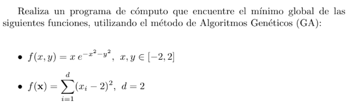
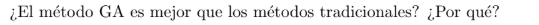

# Assignment: Práctica 3, Sistemas Inteligentes II

> Source: page 1 and page 4 of the [original report](original/practica-3-genetic-algorithms-report.pdf). The assignment text was embedded in the report as an image (reproduced below) and is translated here from Spanish.

## Statement (translated)

> Write a computer program that finds the global minimum of the following functions, using the Genetic Algorithms (GA) method:
>
> - f(x, y) = x · e^(−x² − y²),  x, y ∈ [−2, 2]
> - f(**x**) = Σᵢ₌₁ᵈ (xᵢ − 2)²,  d = 2

## Discussion Question (translated)

> Is the GA method better than traditional methods? Why?

## Requirements, as Derived

| # | Requirement | Met by the delivered project? |
|---|---|---|
| R1 | Implement a Genetic Algorithm | Yes: selection, crossover, mutation and replacement are written by hand in `src/` |
| R2 | Minimize f₁(x, y) = x·e^(−x²−y²) on [−2, 2]² | Partly: the code for f₁ is present (commented out) and the report shows convergence, but it searches [−5, 5]² |
| R3 | Minimize f₂(**x**) = Σ(xᵢ − 2)², d = 2 | Yes: this is the active setup in the code |
| R4 | Show results | Yes, graphically (figures in the report); no numeric output |
| R5 | Answer the discussion question | Yes: "Conclusiones y resultados" section of the report |

## Reference Solutions (added for context, not part of the original)

| Function | Global minimum | Location |
|---|---|---|
| f₁ | −1/√(2e) ≈ −0.42888 | (x, y) = (−1/√2, 0) ≈ (−0.7071, 0) |
| f₂ | 0 | (x₁, x₂) = (2, 2) |

These values follow from setting the gradient to zero. They are included only so readers can check the figures.
