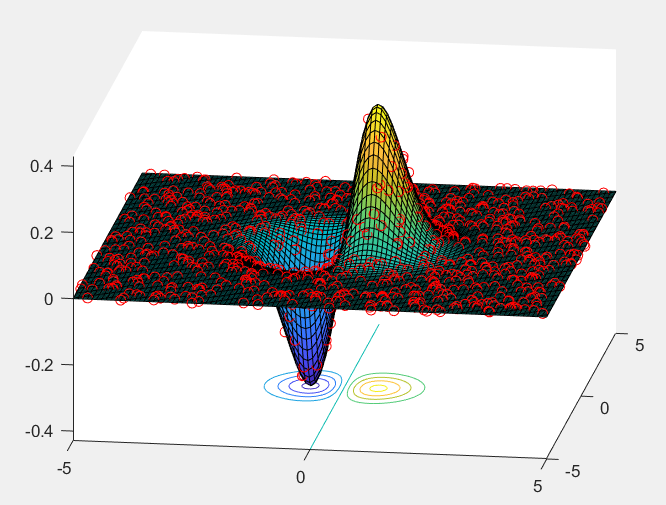
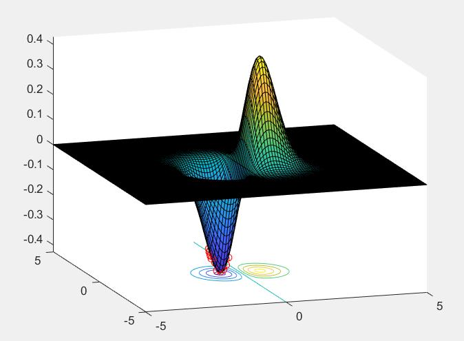
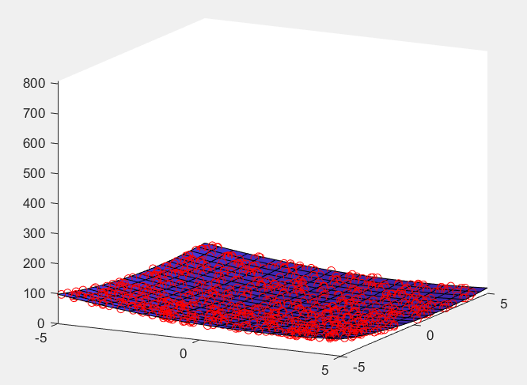
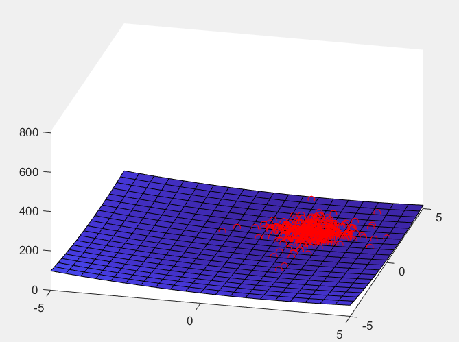

# Original Report: English Summary

> Source: [`original/practica-3-genetic-algorithms-report.pdf`](original/practica-3-genetic-algorithms-report.pdf). The report is 4 pages, in Spanish, dated 18 February 2019. This is a structured summary, not a literal translation. The figures below were extracted from the PDF without modification.

## Page 1: Header, Assignment and Introduction

- **Header:** Universidad de Guadalajara, CUCEI. Omar Baruch Morón López. *Sistemas Inteligentes II*. *Práctica 3*.
- **Assignment:** see [assignment.md](assignment.md).
- **Introduction (theory):**
  - GAs are adaptive methods for search and optimization problems, based on the genetic processes of living organisms.
  - Over generations, populations evolve following natural selection and survival of the fittest (Darwin, 1859). By imitating this, GAs build solutions to real-world problems. How well they reach optimal values depends largely on how the solutions are encoded.
  - The basic principles were set out by Holland (1975) and are described in Goldberg (1989), Davis (1991), Michalewicz (1992) and Reeves (1993).
  - Individuals compete for resources and mates. The best adapted leave more descendants, so their genes spread through the generations. Combining good traits from different ancestors can occasionally produce "super-individuals" that are better adapted than any ancestor.
  - Footnote: `http://www.sc.ehu.es/ccwbayes/docencia/mmcc/docs/temageneticos.pdf` (citing D. H. Ackley (1987), *A Connectionist Machine for Genetic Hillclimbing*, Kluwer Academic Publishers).

## Page 2: Function 1, f(x, y) = x·e^(−x²−y²)

| First generation | After several generations (caption: "After 100 generations") |
|---|---|
|  |  |

- **First generation:** the surface shows a positive peak and a negative valley. The red markers (the random initial population) cover the whole plane.
- **Later:** *"After some generations we see how the population converges to the optimal evolution."* The markers gather at the bottom of the negative valley, the global minimum near (−0.7, 0).
- The caption "After 100 generations" sits under the second figure. The code as saved in the repository runs 5 generations, so this run used different settings (Inferred).

## Page 3: Function 2, f(**x**) = Σ(xᵢ − 2)², d = 2

| First generation | Fifth generation |
|---|---|
|  |  |

- *"Initializes with a random population. In the first generation."* Markers spread over the paraboloid.
- *"It keeps finding the minimum. In the fifth generation."* The markers form a dense cluster around (2, 2).
- These figures match the saved code: function 2 active, `generaciones=5`, `N=1000`, axes limited to [−5, 5].

## Page 4: Conclusions and Results

**Question:** *Is the GA method better than traditional methods? Why?*

**Answer (summarized):**

- A GA can be considered better in some cases, for example when **exploring the environment** matters.
- A drawback is its **cost**: it is a very robust algorithm but uses a lot of computing resources. To find a global minimum, a classical algorithm is usually more advisable.
- The algorithm depends on several parameters:
  - population size,
  - mutation probability,
  - number of genes.
- So the algorithm is highly variable and can be tuned toward either exploration or speed. The two are always a trade-off.

**Personal conclusion (summarized):**

> While implementing the algorithm I realized that, for it to work correctly, a **very large population** is essential. With a small population it is very hard to converge to an optimal solution, and the mutation probability would need to be raised. With more individuals it is easier to converge, as the figures show.

## Notes

- The report gives no numeric value for the minimum found. Results are shown only in the plots.
- The report does not describe the operators used (roulette selection, single-point crossover, reset mutation). They are documented from the code in [code-overview.md](code-overview.md).
